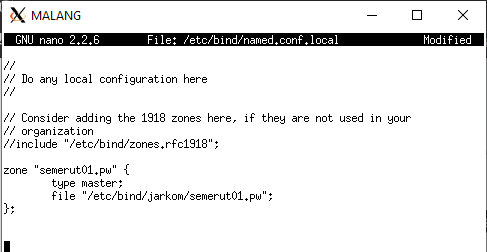

# Lapres Modul 2 Jarkom 2020 - T1  
`"Repository dibuat untuk memenuhi tugas praktikum mata kuliah komunikasi data dan jaringan komputer tahun 2020."`  
  
Anggota:  
**Adeela Nurul Fadhila** `[05311840000001]` [@Rinnabel](https://github.com/Rinnabel)  
**Muhammad Ilya Asha Soegondo** `[05311840000010]` [@ilyaasha24](https://github.com/ilyaasha24/)  

Asisten:  
**Arino Jenynof** `[05111740000096]`  

Penguji:  
*Ismail Arifin** `[05111740007007]`  

### 1. Membuat sebuah website utama dengan alamat http://semeruyyy.pw
Mengikuti langkah-langkah yang sudah dijelaskan di modul 2
* Buka MALANG dan update package lists dengan menjalankan command : `apt-get update`
* Instal aplikasi bind9 pada Malang dengan perintah : `apt-get install bind9 -y`
* Lakukan perintah pada MALANG : ` nano /etc/bind/named.conf.local`
* Lakukan konfigurasi untuk domain semerut01.pw
  