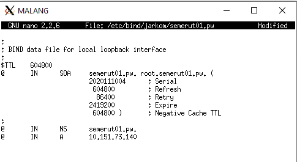
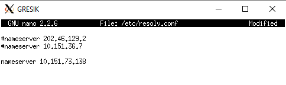

# Lapres Modul 2 Jarkom 2020 - T1  
`"Repository dibuat untuk memenuhi tugas praktikum mata kuliah komunikasi data dan jaringan komputer tahun 2020."`  
  
Anggota:  
**Adeela Nurul Fadhila** `[05311840000001]` [@Rinnabel](https://github.com/Rinnabel)  
**Muhammad Ilya Asha Soegondo** `[05311840000010]` [@ilyaasha24](https://github.com/ilyaasha24/)  

Asisten:  
**Arino Jenynof** `[05111740000096]`  

Penguji:  
**Ismail Arifin** `[05111740007007]`  


### 1. Membuat sebuah website utama dengan alamat http://semeruyyy.pw
Mengikuti langkah-langkah yang sudah dijelaskan di modul 2
* Buka MALANG dan update package lists dengan menjalankan command : `apt-get update`
* Instal aplikasi bind9 pada Malang dengan perintah : `apt-get install bind9 -y`
* Lakukan perintah pada MALANG : ` nano /etc/bind/named.conf.local`
* Lakukan konfigurasi untuk domain semerut01.pw

* Buat folder jarkom di dalam /etc/bind : `mkdir /etc/bind/jarkom`
* Copykan file db.local pada path /etc/bind ke dalam folder jarkom dan ubah namanya menjadi semerut01/pw :
```
cp /etc/bind/db.local /etc/bind/jarkom/semerut01.pw
```
* Buka file jarkom2020.com dan edit seperti gambar berikut :
```
nano /etc/bind/jarkom/semerut01.pw
```

* Restart bind9 dengan perintah : `service bind9 restart`
* Pada client GRESIK dan SIDOARJO arahkan nameserver menuju IP MALANG dengan mengedit file resolv conf dengan mengetikkan perintah :
```
nano /etc/resolv.conf
```

* Untuk mencoba koneksi DNS, lakukan ping domain semerut01.pw dengan melakukan perintah berikut pada client GRESIK dan SIDOARJO :
```
ping semerut01.pw
```