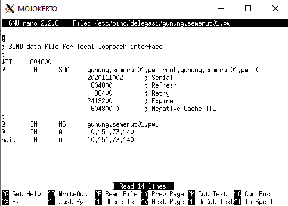

# Lapres Modul 2 Jarkom 2020 - T1  
`"Repository dibuat untuk memenuhi tugas praktikum mata kuliah komunikasi data dan jaringan komputer tahun 2020."`  
  
Anggota:  
**Adeela Nurul Fadhila** `[05311840000001]` [@Rinnabel](https://github.com/Rinnabel)  
**Muhammad Ilya Asha Soegondo** `[05311840000010]` [@ilyaasha24](https://github.com/ilyaasha24/)  

Asisten:  
**Arino Jenynof** `[05111740000096]`  

Penguji:  
**Ismail Arifin** `[05111740007007]`  


### 1. Membuat sebuah website utama dengan alamat http://semeruyyy.pw
Mengikuti langkah-langkah yang sudah dijelaskan di modul 2
* Buka MALANG dan update package lists dengan menjalankan command : `apt-get update`
* Instal aplikasi bind9 pada Malang dengan perintah : `apt-get install bind9 -y`
* Lakukan perintah pada MALANG : ` nano /etc/bind/named.conf.local`
* Lakukan konfigurasi untuk domain semerut01.pw

* Buat folder jarkom di dalam /etc/bind : `mkdir /etc/bind/jarkom`
* Copykan file db.local pada path /etc/bind ke dalam folder jarkom dan ubah namanya menjadi semerut01/pw :
    ```
    cp /etc/bind/db.local /etc/bind/jarkom/semerut01.pw
    ```
* Buka file jarkom2020.com dan edit seperti gambar berikut :
    ```
    nano /etc/bind/jarkom/semerut01.pw
    ```

* Restart bind9 dengan perintah : `service bind9 restart`
* Pada client GRESIK dan SIDOARJO arahkan nameserver menuju IP MALANG dengan mengedit file resolv conf dengan mengetikkan perintah :
    ```
    nano /etc/resolv.conf
    ```

* Untuk mencoba koneksi DNS, lakukan ping domain semerut01.pw dengan melakukan perintah berikut pada client GRESIK dan SIDOARJO :
    ```
    ping semerut01.pw
    ```


### 2. Buat alias http://www.semeruyyy.pw
* Buka file semerut.pw pada server MALANG dan tambahkan konfigurasi seperti pada gambar berikut:

* Restart bind9 dengan perintah : `service bind9 restart`
* Lalu cek di GRESIK dengan : `ping www.semerut01.pw`


### 3. Buat subdomain http://penanjakan.semeruyyy.pw
* Edit file /etc/bind/jarkom/semerut01.pw lalu tambahkan subdomain untuk semerut01.pw yang mengarah ke IP PROBOLINGGO.
    ```
    nano /etc/bind/jarkom/semerut01.pw
    ```

* Restart bind9 dengan perintah : `service bind9 restart`
* Ping ke subdomain dengan perintah berikut dari client GRESIK : `ping penanjakan.semerut01.pw`


### 4. Buat reverse domain untuk domain utama
* Edit file /etc/bind/named.conf.local pada MALANG dengan menambahkan konfigurasi sebagai berikut :
    ```
    nano /etc/bind/named.conf.local
    ```

* Copykan file db.local pada path /etc/bind ke dalam folder jarkom dan ubah namanya menjadi 73.151.10.in-addr.arpa :
    ```
    cp /etc/bind/db.local /etc/bind/jarkom/73.151.10.in-addr.arpa
    ```
* Edit file 73.151.10.in-addr.arpa

* Restart bind9 dengan perintah : `service bind9 restart`

### 5. Buat DNS Server Slave pada MOJOKERTO
* Edit file /etc/bind/named.conf.local pada Server MALANG

* Restart bind9 dengan perintah : `service bind9 restart`
* Buka MOJOKERTO dan update package lists : `apt-get update`
* Install aplikasi bind9 pada MOJOKERTO dengan perintah : `apt-get install bind9 -y`
* Kemudian buka file /etc/bind/named.conf.local pada MOJOKERTO dan lakukan konfigirasi sebagai berikut :

* Restart bind9 dengan perintah : `service bind9 restart`

### 6. Buat subdomain dengan alamat http://gunung.semeruyyy.pw yang didelegasikan pada server MOJOKERTO dan mengarah ke IP Server PROBOLINGGO
* Edit file /etc/bind/jarkom/semerut01.pw di MALANG lalu tambahkan konfigurasi sebagai berikut:

* Buka file /etc/bind/named.conf.options pada MALANG, kemudian comment dnssec-validation auto; dan tambahkan baris berikut pada /etc/bind/named.conf.options
    ```
    allow-query{any;};
    ```

* Kemudian edit file /etc/bind/named.conf.local menjadi seperti gambar di bawah :

* Restart bind9 dengan perintah : `service bind9 restart`
* Pindah ke MOJOKERTO dan lakukan konfigurasi file /etc/bind/named.conf.options sama seperti di MALANG
* Edit file edit file /etc/bind/named.conf.local menjadi seperti gambar di bawah: menjadi seperti gambar di bawah :

* Buat direktori dengan nama delegasi kemudian copy db.local ke direktori delegasi dan edit namanya menjadi gunung.semerut01.pw
    ```
    mkdir /etc/bind/delegasi
    cp /etc/bind/db.local /etc/bind/delegasi/gunung.semerut01.pw
    ```
* Kemudian edit file gunung.semerut01.pw menjadi seperti dibawah ini :

* Restart bind9 dengan perintah : `service bind9 restart`

### 7. Buatlah subdomain dengan nama http://naik.gunung.semeruyyy.pw, domain ini diarahkan ke IP Server PROBOLINGGO.
* Tambahkan konfigurasi pada file /etc/bind/delegasi/gunung.semerut01.pw seperti berikut :

* Restart bind9 dengan perintah : `service bind9 restart`
