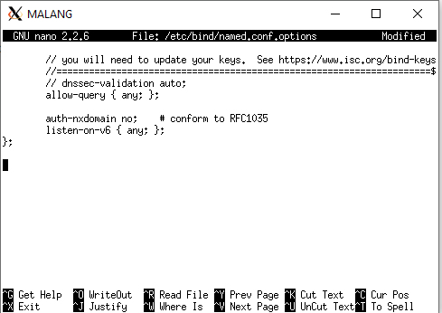

# Lapres Modul 2 Jarkom 2020 - T1  
`"Repository dibuat untuk memenuhi tugas praktikum mata kuliah komunikasi data dan jaringan komputer tahun 2020."`  
  
Anggota:  
**Adeela Nurul Fadhila** `[05311840000001]` [@Rinnabel](https://github.com/Rinnabel)  
**Muhammad Ilya Asha Soegondo** `[05311840000010]` [@ilyaasha24](https://github.com/ilyaasha24/)  

Asisten:  
**Arino Jenynof** `[05111740000096]`  

Penguji:  
**Ismail Arifin** `[05111740007007]`  

## Daftar Isi  
- [Lapres Modul 2 Jarkom 2020 - T1](#lapres-modul-2-jarkom-2020---t1)
  - [Daftar Isi](#daftar-isi)
  - [File pendukung:](#file-pendukung)
    - [a. semerut01.pw: `wget 10.151.36.202/semeru.pw.zip`](#a-semerut01pw-wget-1015136202semerupwzip)
    - [b. penanjakan.semerut01.pw: `wget 10.151.36.202/penanjakan.semeru.pw.zip`](#b-penanjakansemerut01pw-wget-1015136202penanjakansemerupwzip)
    - [c. naik.gunung.semerut01.pw: `wget 10.151.36.202/naik.gunung.semeru.pw.zip`](#c-naikgunungsemerut01pw-wget-1015136202naikgunungsemerupwzip)
  - [DNS](#dns)
    - [1. Membuat sebuah website utama dengan alamat http://semerut01.pw](#1-membuat-sebuah-website-utama-dengan-alamat-httpsemerut01pw)
    - [2. Buat alias http://www.semerut01.pw](#2-buat-alias-httpwwwsemerut01pw)
    - [3. Buat subdomain http://penanjakan.semerut01.pw](#3-buat-subdomain-httppenanjakansemerut01pw)
    - [4. Buat reverse domain untuk domain utama](#4-buat-reverse-domain-untuk-domain-utama)
    - [5. Buat DNS Server Slave pada MOJOKERTO](#5-buat-dns-server-slave-pada-mojokerto)
    - [6. Buat subdomain dengan alamat http://gunung.semerut01.pw yang didelegasikan pada server MOJOKERTO dan mengarah ke IP Server PROBOLINGGO](#6-buat-subdomain-dengan-alamat-httpgunungsemerut01pw-yang-didelegasikan-pada-server-mojokerto-dan-mengarah-ke-ip-server-probolinggo)
    - [7. Buatlah subdomain dengan nama http://naik.gunung.semerut01.pw, domain ini diarahkan ke IP Server PROBOLINGGO.](#7-buatlah-subdomain-dengan-nama-httpnaikgunungsemerut01pw-domain-ini-diarahkan-ke-ip-server-probolinggo)
  - [Webserver](#webserver)
    - [8. Domain http://semerut01.pw memiliki DocumentRoot pada /var/www/semerut01.pw.](#8-domain-httpsemerut01pw-memiliki-documentroot-pada-varwwwsemerut01pw)
    - [9. diaktifkan mod rewrite agar urlnya menjadi http://semerut01.pw/home.](#9-diaktifkan-mod-rewrite-agar-urlnya-menjadi-httpsemerut01pwhome)
    - [10. Web http://penanjakan.semerut01.pw akan digunakan untuk menyimpan assets file yang memiliki DocumentRoot pada /var/www/penanjakan.semerut01.pw](#10-web-httppenanjakansemerut01pw-akan-digunakan-untuk-menyimpan-assets-file-yang-memiliki-documentroot-pada-varwwwpenanjakansemerut01pw)
    - [11. Pada folder /public dibolehkan directory listing namun untuk folder yang berada di dalamnya tidak dibolehkan.](#11-pada-folder-public-dibolehkan-directory-listing-namun-untuk-folder-yang-berada-di-dalamnya-tidak-dibolehkan)
    - [12. Untuk mengatasi HTTP Error code 404, disediakan file 404.html pada folder /errors untuk mengganti error default 404 dari Apache.](#12-untuk-mengatasi-http-error-code-404-disediakan-file-404html-pada-folder-errors-untuk-mengganti-error-default-404-dari-apache)
    - [13. Untuk mengakses file assets javascript awalnya harus menggunakan url http://penanjakan.semerut01.pw/public/javascripts. Karena terlalu panjang maka dibuatkan konfigurasi virtual host agar ketika mengakses file assets menjadi http://penanjakan.semerut01.pw/js.](#13-untuk-mengakses-file-assets-javascript-awalnya-harus-menggunakan-url-httppenanjakansemerut01pwpublicjavascripts-karena-terlalu-panjang-maka-dibuatkan-konfigurasi-virtual-host-agar-ketika-mengakses-file-assets-menjadi-httppenanjakansemerut01pwjs)
    - [14. sedangkan web http://naik.gunung.semerut01.pw sudah bisa diakses hanya dengan menggunakan port 8888. DocumentRoot web berada pada /var/www/naik.gunung.semerut01.pw.](#14-sedangkan-web-httpnaikgunungsemerut01pw-sudah-bisa-diakses-hanya-dengan-menggunakan-port-8888-documentroot-web-berada-pada-varwwwnaikgunungsemerut01pw)
    - [15. Bibah meminta kamu membuat web http://naik.gunung.semerut01.pw agar diberi autentikasi password dengan username “semeru” dan password “kuynaikgunung” supaya aman dan tidak sembarang orang bisa mengaksesnya.](#15-bibah-meminta-kamu-membuat-web-httpnaikgunungsemerut01pw-agar-diberi-autentikasi-password-dengan-username-semeru-dan-password-kuynaikgunung-supaya-aman-dan-tidak-sembarang-orang-bisa-mengaksesnya)
    - [16. Karena dirasa kurang profesional, maka setiap Bibah mengunjungi IP PROBOLINGGO akan dialihkan secara otomatis ke http://semerut01.pw.](#16-karena-dirasa-kurang-profesional-maka-setiap-bibah-mengunjungi-ip-probolinggo-akan-dialihkan-secara-otomatis-ke-httpsemerut01pw)
    - [17. Karena pengunjung pada /var/www/penanjakan.semerut01.pw/public/images sangat banyak maka semua request gambar yang memiliki substring “semeru” akan diarahkan menuju semeru.jpg.](#17-karena-pengunjung-pada-varwwwpenanjakansemerut01pwpublicimages-sangat-banyak-maka-semua-request-gambar-yang-memiliki-substring-semeru-akan-diarahkan-menuju-semerujpg)

## File pendukung: 
### a. semerut01.pw: `wget 10.151.36.202/semeru.pw.zip`
### b. penanjakan.semerut01.pw: `wget 10.151.36.202/penanjakan.semeru.pw.zip`
### c. naik.gunung.semerut01.pw: `wget 10.151.36.202/naik.gunung.semeru.pw.zip`


## DNS
### 1. Membuat sebuah website utama dengan alamat http://semerut01.pw
Mengikuti langkah-langkah yang sudah dijelaskan di modul 2
* Buka MALANG dan update package lists dengan menjalankan command : `apt-get update`
* Instal aplikasi bind9 pada Malang dengan perintah : `apt-get install bind9 -y`
* Lakukan perintah pada MALANG : ` nano /etc/bind/named.conf.local`
* Lakukan konfigurasi untuk domain semerut01.pw

* Buat folder jarkom di dalam /etc/bind : `mkdir /etc/bind/jarkom`
* Copykan file db.local pada path /etc/bind ke dalam folder jarkom dan ubah namanya menjadi semerut01/pw :
    ```
    cp /etc/bind/db.local /etc/bind/jarkom/semerut01.pw
    ```
* Buka file semerut01.pw dan edit seperti gambar berikut :
    ```
    nano /etc/bind/jarkom/semerut01.pw
    ```

* Restart bind9 dengan perintah : `service bind9 restart`
* Pada client GRESIK dan SIDOARJO arahkan nameserver menuju IP MALANG dengan mengedit file resolv conf dengan mengetikkan perintah :
    ```
    nano /etc/resolv.conf
    ```

* Untuk mencoba koneksi DNS, lakukan ping domain semerut01.pw dengan melakukan perintah berikut pada client GRESIK dan SIDOARJO :
    ```
    ping semerut01.pw
    ```


### 2. Buat alias http://www.semerut01.pw
* Buka file semerut.pw pada server MALANG dan tambahkan konfigurasi seperti pada gambar berikut:

* Restart bind9 dengan perintah : `service bind9 restart`
* Lalu cek di GRESIK dengan : `ping www.semerut01.pw`


### 3. Buat subdomain http://penanjakan.semerut01.pw
* Edit file /etc/bind/jarkom/semerut01.pw lalu tambahkan subdomain untuk semerut01.pw yang mengarah ke IP PROBOLINGGO.
    ```
    nano /etc/bind/jarkom/semerut01.pw
    ```

* Restart bind9 dengan perintah : `service bind9 restart`
* Ping ke subdomain dengan perintah berikut dari client GRESIK : `ping penanjakan.semerut01.pw`


### 4. Buat reverse domain untuk domain utama
* Edit file /etc/bind/named.conf.local pada MALANG dengan menambahkan konfigurasi sebagai berikut :
    ```
    nano /etc/bind/named.conf.local
    ```

* Copykan file db.local pada path /etc/bind ke dalam folder jarkom dan ubah namanya menjadi 73.151.10.in-addr.arpa :
    ```
    cp /etc/bind/db.local /etc/bind/jarkom/73.151.10.in-addr.arpa
    ```
* Edit file 73.151.10.in-addr.arpa


* Restart bind9 dengan perintah : `service bind9 restart`

### 5. Buat DNS Server Slave pada MOJOKERTO
* Edit file /etc/bind/named.conf.local pada Server MALANG

* Restart bind9 dengan perintah : `service bind9 restart`
* Buka MOJOKERTO dan update package lists : `apt-get update`
* Install aplikasi bind9 pada MOJOKERTO dengan perintah : `apt-get install bind9 -y`
* Kemudian buka file /etc/bind/named.conf.local pada MOJOKERTO dan lakukan konfigirasi sebagai berikut :

* Restart bind9 dengan perintah : `service bind9 restart`

### 6. Buat subdomain dengan alamat http://gunung.semerut01.pw yang didelegasikan pada server MOJOKERTO dan mengarah ke IP Server PROBOLINGGO
* Edit file /etc/bind/jarkom/semerut01.pw di MALANG lalu tambahkan konfigurasi sebagai berikut:

* Buka file /etc/bind/named.conf.options pada MALANG, kemudian comment dnssec-validation auto; dan tambahkan baris berikut pada /etc/bind/named.conf.options
    ```
    allow-query{any;};
    ```

* Kemudian edit file /etc/bind/named.conf.local menjadi seperti gambar di bawah :

* Restart bind9 dengan perintah : `service bind9 restart`
* Pindah ke MOJOKERTO dan lakukan konfigurasi file /etc/bind/named.conf.options sama seperti di MALANG
* Edit file edit file /etc/bind/named.conf.local menjadi seperti gambar di bawah: menjadi seperti gambar di bawah :

* Buat direktori dengan nama delegasi kemudian copy db.local ke direktori delegasi dan edit namanya menjadi gunung.semerut01.pw
    ```
    mkdir /etc/bind/delegasi
    cp /etc/bind/db.local /etc/bind/delegasi/gunung.semerut01.pw
    ```
* Kemudian edit file gunung.semerut01.pw menjadi seperti dibawah ini :

* Restart bind9 dengan perintah : `service bind9 restart`

### 7. Buatlah subdomain dengan nama http://naik.gunung.semerut01.pw, domain ini diarahkan ke IP Server PROBOLINGGO.
* Tambahkan konfigurasi pada file /etc/bind/delegasi/gunung.semerut01.pw seperti berikut :

* Restart bind9 dengan perintah : `service bind9 restart`

## Webserver
### 8. Domain http://semerut01.pw memiliki DocumentRoot pada /var/www/semerut01.pw.
* Buka UML _PROBOLINGGO_
Lalu install apache dan php
```
apt-get install apache2
apt-get install php5
```
jika muncul tulisan _"Do you want to continue? [Y/n]"_  input `Y` lalu tekan ___enter___.
* Unduh file pendukung diatas: `wget 10.151.36.202/semeru.pw.zip`
* Ekstrak dengan `unzip semeru.pw.zip`
* Pindahkan ke direktori `/var/www`
* Rename folder menjadi `semerut01.pw`
* Buat file konfigurasi menggunakan `cp default semerut01.pw` pada folder `/etc/apache2/sites-available`
* Set DocumentRoot ke `/var/www/semerut01.pw`
* Lalu lakukan perintah `a2ensite semerut01.pw` untuk mengaktifkan file konfigurasi
* restart apache2 dengan perintah `service apache2 restart`

### 9. diaktifkan mod rewrite agar urlnya menjadi http://semerut01.pw/home.
* Buat file `.htaccess` dengan `nano .htaccess` pada folder `/var/www/semerut01.pw`
* Isi dengan 
```
RewriteEngine On
RewriteCond %{REQUEST_FILENAME} !-d
RewriteRule ^(home)$ /index.php/home [NC,L]
```
* Isi berikut pada konfigurasi `semerut01.pw`
```
 <Directory /var/www/semerut01.pw>
     Options +FollowSymLinks -Multiviews
     AllowOverride All
 </Directory>
```
* Jangan lupa `a2enmod rewrite` dan `service apache2 restart`

### 10. Web http://penanjakan.semerut01.pw akan digunakan untuk menyimpan assets file yang memiliki DocumentRoot pada /var/www/penanjakan.semerut01.pw
* Unduh file pendukung diatas: `wget 10.151.36.202/penanjakan.semeru.pw.zip`
* Ekstrak dengan `unzip penanjakan.semeru.pw.zip`
* Pindahkan ke direktori `/var/www`
* Rename folder menjadi `penanjakan.semerut01.pw`
* Buat file konfigurasi menggunakan `cp default semerut01.pw` pada folder `/etc/apache2/sites-available`
* Set DocumentRoot ke `/var/www/penanjakan.semerut01.pw`
* Lalu lakukan perintah `a2ensite semerut01.pw` untuk mengaktifkan file konfigurasi
* restart apache2 dengan perintah `service apache2 restart`

### 11. Pada folder /public dibolehkan directory listing namun untuk folder yang berada di dalamnya tidak dibolehkan.
* Isi berikut pada `/etc/apache2/sites-available/penanjakan.semerut01.pw` 
  ```
        <Directory /var/www/penanjakan.semerut01.pw/public>
                Options +Indexes
        </Directory>
        <Directory /var/www/penanjakan.semerut01.pw/public/*>
                Options -Indexes
        </Directory>
  ```
* restart apache2 dengan perintah `service apache2 restart`

### 12. Untuk mengatasi HTTP Error code 404, disediakan file 404.html pada folder /errors untuk mengganti error default 404 dari Apache.
* Isi berikut pada `/var/www/penanjakan.semerut01.pw/.htaccess`
  ```
  ErrorDocument 404 /errors/404.html
  ```
* restart apache2 dengan perintah `service apache2 restart`

### 13. Untuk mengakses file assets javascript awalnya harus menggunakan url http://penanjakan.semerut01.pw/public/javascripts. Karena terlalu panjang maka dibuatkan konfigurasi virtual host agar ketika mengakses file assets menjadi http://penanjakan.semerut01.pw/js.
* Isi berikut pada `/etc/apache2/sites-available/penanjakan.semerut01.pw`
  ```
  Alias "/js" "/var/www/penanjakan.semerut01.pw/public/javascripts"
  ```
* restart apache2 dengan perintah `service apache2 restart`

### 14. sedangkan web http://naik.gunung.semerut01.pw sudah bisa diakses hanya dengan menggunakan port 8888. DocumentRoot web berada pada /var/www/naik.gunung.semerut01.pw.
* Unduh file pendukung diatas: `wget 10.151.36.202/naik.gunung.semeru.pw.zip`
* Ekstrak dengan `unzip naik.gunung.semeru.pw.zip`
* Pindahkan ke direktori `/var/www`
* Rename folder menjadi `naik.gunung.semerut01.pw`
* Buat file konfigurasi menggunakan `cp default semerut01.pw` pada folder `/etc/apache2/sites-available`
* Lalu lakukan perintah `a2ensite semerut01.pw` untuk mengaktifkan file konfigurasi
* Listen di port 8888
  
* set konfig web agar listen pada port 8888
  
* restart apache2 dengan perintah `service apache2 restart`


### 15. Bibah meminta kamu membuat web http://naik.gunung.semerut01.pw agar diberi autentikasi password dengan username “semeru” dan password “kuynaikgunung” supaya aman dan tidak sembarang orang bisa mengaksesnya.
* `apt-get update`
* `apt-get install apache2 apache2-utils`
* set konfig web untuk auth basic
  
* set user `htpasswd -c /etc/apache2/.htpasswd semeru`
* set password lalu ok
* restart apache2 dengan perintah `service apache2 restart`

### 16. Karena dirasa kurang profesional, maka setiap Bibah mengunjungi IP PROBOLINGGO akan dialihkan secara otomatis ke http://semerut01.pw.
* set DocumentRoot pada `/etc/apache2/sites-available/default`
  
* set paragraf paling bawah di `/var/www/semerut01.pw/.htaccess`
  
* restart apache2 dengan perintah `service apache2 restart`

### 17. Karena pengunjung pada /var/www/penanjakan.semerut01.pw/public/images sangat banyak maka semua request gambar yang memiliki substring “semeru” akan diarahkan menuju semeru.jpg.
* set 2 line terakhir di `/var/www/penanjakan.semerut01.pw/.htaccess` 
  
* restart apache2 dengan perintah `service apache2 restart`